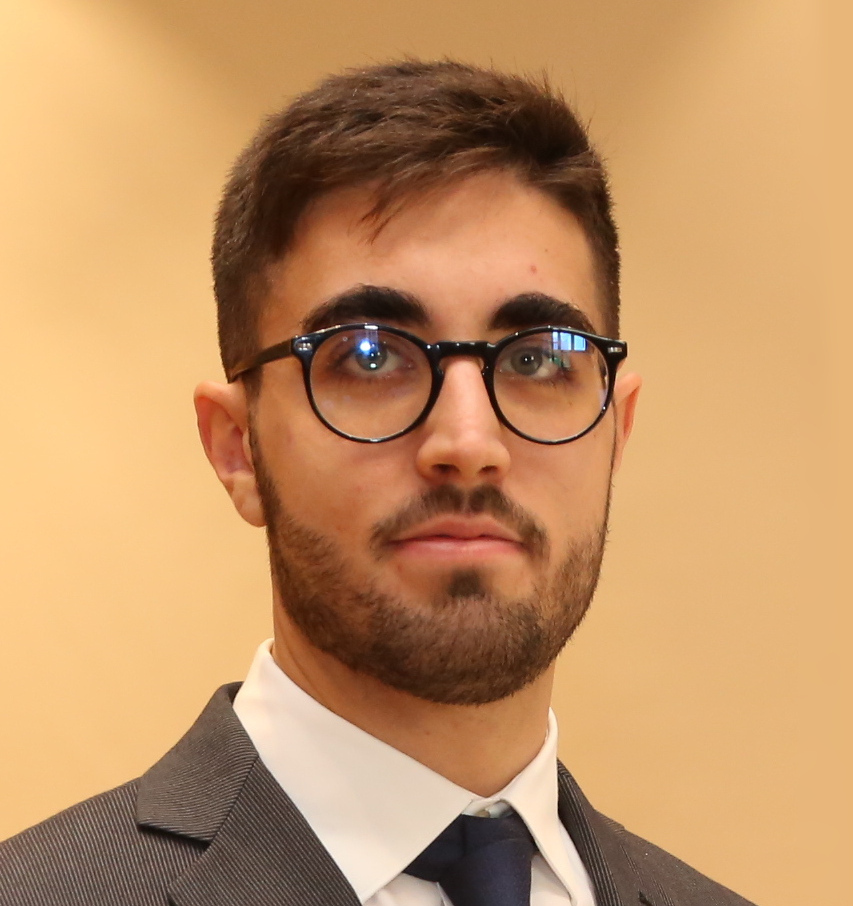

# Michele Chiari

My research interests cover formal methods for the verification of safety-critical and real-time systems, focusing on temporal logic, formal languages and automata theory.

I am currently working on context-free temporal logic and model checking. In particular, I am developing new temporal logics based on Operator Precedence Languages, with the purpose of allowing better and more general modelling and specification of procedural programs.
